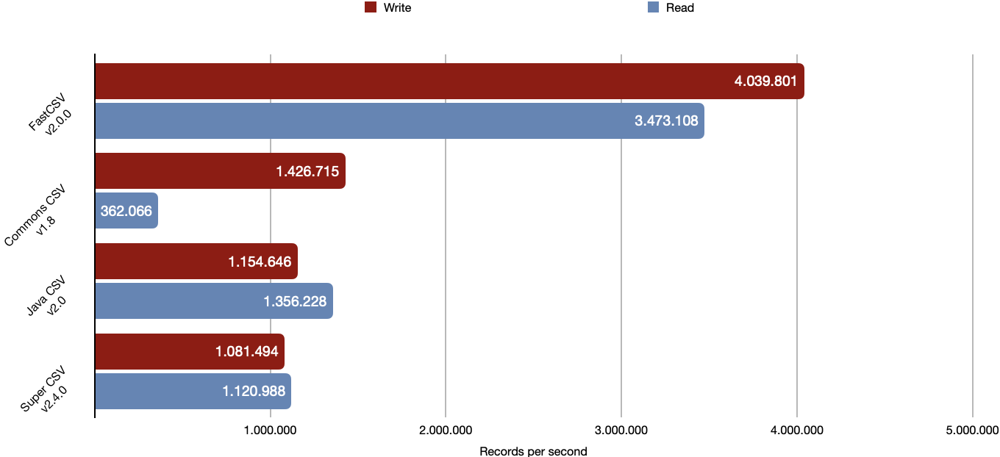

<p>
  <picture>
    <source media="(prefers-color-scheme: dark)" type="image/avif" srcset="fastcsv_dark.avif 2x">
    <source media="(prefers-color-scheme: light)" type="image/avif" srcset="fastcsv_light.avif 2x">
    
  </picture>
</p>

[](https://github.com/osiegmar/FastCSV/actions/workflows/build.yml)
[](https://www.codacy.com/gh/osiegmar/FastCSV/dashboard?utm_source=github.com&amp;utm_medium=referral&amp;utm_content=osiegmar/FastCSV&amp;utm_campaign=Badge_Grade)
[](https://app.codecov.io/gh/osiegmar/FastCSV/branch/master)
[](https://javadoc.io/doc/de.siegmar/fastcsv)
[](https://search.maven.org/artifact/de.siegmar/fastcsv)

FastCSV is an ultra-fast and dependency-free [RFC 4180](https://tools.ietf.org/html/rfc4180) compliant CSV
library for Java.

Actively developed and maintained since 2015 its primary intended use cases are:
- big data applications to read and write data on a massive scale
- small data applications with the need for a lightweight library

## Benchmark & Compatibility

A selected benchmark from the
[Java CSV library benchmark suite](https://github.com/osiegmar/JavaCsvBenchmarkSuite) project:



While maintaining high performance, FastCSV is a strict RFC 4180 CSV writer but also able
to read garbled CSV data (to some degree). See [JavaCsvComparison](https://github.com/osiegmar/JavaCsvComparison) for details.

## Features

### API

- Ultra fast
- Small footprint
- Zero runtime dependencies
- Null-free

### CSV specific

- RFC 4180 compliant – including:
  - Newline and field separator characters in fields
  - Quote escaping
- Configurable field separator
- Support for line endings CRLF (Windows), CR (old macOS) and LF (Unix)
- Unicode support

### Reader specific

- Support reading of some non-compliant (real world) data
- Preserving line break character(s) within fields
- Preserving the original line number (even with skipped and multi line records) –
  helpful for error messages
- Auto-detection of line delimiters (can also be mixed)
- Configurable data validation
- Support for (optional) header lines (get field based on column name)
- Support for skipping empty rows
- Support for commented lines (skipping & reading) and configurable comment character

### Writer specific

- Support for multiple quote strategies to differentiate between empty and null
- Support for writing comments with proper quotation if needed

## Requirements

- Java 8

> :bulb: Android is not Java and is not officially supported.
> Although some basic checks are included in the continuous integration pipeline in order to
> verify that the library *should* work with Android 8.0 (API level 26).

## CsvReader Examples

Iterative reading of some CSV data from a string

```java
CsvReader.builder().build("foo1,bar1\r\nfoo2,bar2")
    .forEach(System.out::println);
```

Iterative reading of some CSV data with a header

```java
NamedCsvReader.builder().build("header 1,header 2\nfield 1,field 2")
    .forEach(row -> row.getField("header 2"));
```

Iterative reading of a CSV file

```java
try (CsvReader csv = CsvReader.builder().build(path)) {
    csv.forEach(System.out::println);
}
```

Custom settings

```java
CsvReader.builder()
    .fieldSeparator(';')
    .quoteCharacter('"')
    .commentStrategy(CommentStrategy.SKIP)
    .commentCharacter('#')
    .skipEmptyRows(true)
    .errorOnDifferentFieldCount(false);
```

For more example see
[CsvReaderExample.java](src/example/java/example/CsvReaderExample.java)

## CsvWriter Examples

Iterative writing of some data to a writer

```java
CsvWriter.builder().build(new PrintWriter(System.out, true))
    .writeRow("header1", "header2")
    .writeRow("value1", "value2");
```

Iterative writing of a CSV file

```java
try (CsvWriter csv = CsvWriter.builder().build(path)) {
    csv
        .writeRow("header1", "header2")
        .writeRow("value1", "value2");
}
```

Custom settings

```java
CsvWriter.builder()
    .fieldSeparator(',')
    .quoteCharacter('"')
    .quoteStrategy(QuoteStrategy.REQUIRED)
    .lineDelimiter(LineDelimiter.LF);
```

For more example see
[CsvWriterExample.java](src/example/java/example/CsvWriterExample.java)

## Upgrading from version 1.x

Please see [UPGRADING.md](UPGRADING.md) for an overview of the main functionality of 1.x
and how to upgrade them to version 2.

---

## Sponsoring and partnerships


YourKit was used to optimize the performance and footprint of FastCSV.
YourKit is the creator of <a href="https://www.yourkit.com/java/profiler/">YourKit Java Profiler</a>,
<a href="https://www.yourkit.com/.net/profiler/">YourKit .NET Profiler</a>,
and <a href="https://www.yourkit.com/youmonitor/">YourKit YouMonitor</a>.
