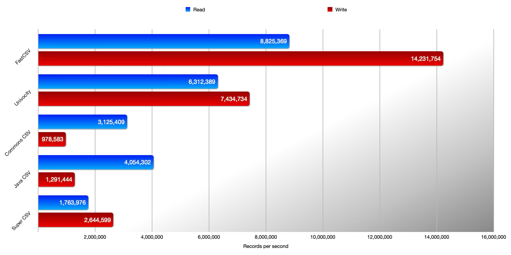

<p align="center">
  
</p>

<p align="center">
  <strong>FastCSV</strong>: fast, lightweight, and easy to use — the production-proven CSV library for Java.<br/>
  It’s the most-starred CSV library for Java and trusted by leading open-source projects such as Apache NiFi, JUnit and Neo4j.
</p>

<p align="center">
  <a href="https://javadoc.io/doc/de.siegmar/fastcsv"></a>
  <a href="https://central.sonatype.com/artifact/de.siegmar/fastcsv"></a>
</p>

<p align="center">
  <a href="https://github.com/osiegmar/FastCSV/actions/workflows/build.yml"></a>
  <a href="https://app.codacy.com/gh/osiegmar/FastCSV/dashboard?utm_source=gh&utm_medium=referral&utm_content=&utm_campaign=Badge_grade"></a>
  <a href="https://codecov.io/gh/osiegmar/FastCSV"></a>
  <a href="https://bugs.chromium.org/p/oss-fuzz/issues/list?sort=-opened&can=1&q=proj:fastcsv"></a>
  <a href="https://www.bestpractices.dev/projects/9141"></a>
</p>

## Features

_Here are the top reasons to choose FastCSV — see [fastcsv.org](https://fastcsv.org) for the full feature list._

- **Fast CSV processing** — optimized for high-speed reading and writing
- **Tiny footprint** — only ~90 KiB, with zero runtime dependencies
- **Developer-friendly API** — clean, intuitive, and easy to integrate
- **Well-documented** — Quickstart guides and complete Javadoc
- **High test coverage** — including mutation testing for reliability
- **RFC 4180 compliant** — handles edge cases correctly
- **Robust & maintainable** — uses SpotBugs, PMD, Error Prone, NullAway, and Checkstyle to ensure code quality; never returns null unexpectedly
- **Secure** — fuzz-tested via OSS-Fuzz and following OpenSSF best practices
- **Production-proven** — trusted by open-source projects like JUnit
- **Java 17+, Android 34+** compatible — including GraalVM Native Image and OSGi

## Performance


Based on the [Java CSV library benchmark suite](https://github.com/osiegmar/JavaCsvBenchmarkSuite).

## Quick Start

### Writing CSV

```java
try (CsvWriter csv = CsvWriter.builder().build(Path.of("output.csv"))) {
    csv
        .writeRecord("header 1", "header 2")
        .writeRecord("value 1", "value 2");
}
```

### Reading CSV

```java
try (CsvReader<CsvRecord> csv = CsvReader.builder().ofCsvRecord(Path.of("input.csv"))) {
    csv.forEach(IO::println);
}
```

---

For more examples and detailed documentation, visit [fastcsv.org](https://fastcsv.org).
If you find FastCSV useful, consider leaving a [star](https://github.com/osiegmar/FastCSV)!

## License

[MIT](LICENSE)
