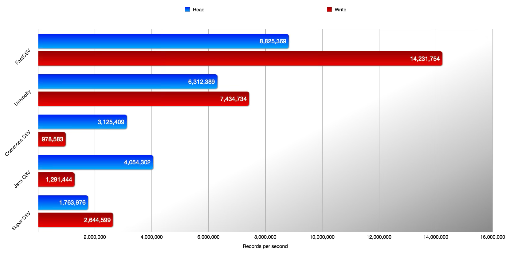

import { Image } from 'astro:assets';
import ykLogo from '../../assets/yklogo.svg';

## Introduction

FastCSV is a high-performance CSV parser and writer for Java licensed under the [MIT open source license](https://opensource.org/license/mit).
It is designed to not only be fast and lightweight but also to be compliant with the CSV specification
[RFC 4180](https://datatracker.ietf.org/doc/html/rfc4180).

:::tip[Did you know?]
Among all actively maintained CSV libraries for Java, FastCSV is the most popular, according to GitHub stars.
Don't forget to leave a ⭐ on [GitHub](https://github.com/osiegmar/FastCSV) if you like FastCSV!
:::

### Benchmark

This selected benchmark is based on the [Java CSV library benchmark suite](https://github.com/osiegmar/JavaCsvBenchmarkSuite).

### Real-world CSV data

Reading and writing perfectly formatted CSV data is straightforward. However, real-world CSV data is often not perfectly formatted.
See [Java Csv Comparison Project](https://github.com/osiegmar/JavaCsvComparison) on how CSV libraries handle real-world CSV data and how FastCSV compares to other libraries.

## Use Cases

The primary use cases are:

- In *big data* applications: efficiently reading and writing data on a massive scale.
- In *small data* applications: serving as a lightweight library without additional dependencies.

## Features

The main features of FastCSV include:

- Enables ultra-fast reading and writing of CSV data
- Has zero runtime dependencies
- Maintains a small footprint
- Provides a null-free and developer-friendly API
- Compatible with GraalVM Native Image
- Delivered as an OSGi-compliant bundle
- Actively developed and maintained
- Well-tested and documented
- Crafted with natural intelligence, ❤️, and AI assistance ✨

### CSV specific

- Compliant with [RFC 4180](https://tools.ietf.org/html/rfc4180) – including:
  - Newline and field separator characters in fields
  - Quote escaping
- Configurable field separator
- Supports line endings `CRLF` (Windows), `LF` (Unix) and `CR` (old macOS)
- Supports unicode characters

### Reader specific

- Supports reading of some non-compliant (real-world) data
- Preserves line break character(s) within fields
- Preserves the starting line number (even with skipped and multi-line records) – helpful for error messages
- Auto-detection of line delimiters (`CRLF`, `LF`, or `CR` – can also be mixed)
- Configurable data validation
- Supports single and multi-character field separators
- Supports trimming of whitespaces around quoted fields
- Supports optional header records (access fields by name)
- Supports for duplicate header names
- Supports skipping empty lines
- Supports skipping non-CSV header (either by a fixed number of lines or by peeking data)
- Supports commented lines (skipping & reading) with configurable comment character
- Configurable field modifiers (e.g., to trim fields)
- Flexible callback handlers (e.g., to directly map to domain objects)
- BOM (Byte Order Mark) support (UTF-8, UTF-16 LE/BE, UTF-32 LE/BE)

### Writer specific

- Supports flexible quoting strategies (e.g., to differentiate between empty and null)
- Supports writing comments

## Requirements

- for [4.x](https://github.com/osiegmar/FastCSV) version: Java ⩾ 17 (Android 14 / API level 34)
- for [3.x](https://github.com/osiegmar/FastCSV/tree/3.x) version: Java ⩾ 11 (Android 13 / API level 33)
- for [2.x](https://github.com/osiegmar/FastCSV/tree/2.x) version: Java ⩾ 8 (Android 8 / API level 26)

This documentation is based on the latest version of FastCSV (4.x).
For older versions, please refer to the respective Git branches.

:::note
Checks are included in the continuous integration pipeline to verify the library's functionality with Android.
Nevertheless, the library is not tested on Android devices, nor can I provide any support for Android-specific issues.
:::

## Prominent Users

FastCSV is trusted by many open source projects, including:

- **[Apache NiFi](https://nifi.apache.org)** -- "Easy to use, powerful, and reliable system to process and distribute data"
- **[JPMML](https://github.com/jpmml)** -- "Java implementation of the Predictive Model Markup Language"
- **[JUnit](https://junit.org/)** -- "The programmer-friendly testing framework for Java and the JVM"
- **[Karate](https://karatelabs.github.io/karate/)** -- "The only open-source tool to combine API test-automation, mocks, performance-testing and even UI automation into a single, unified framework"
- **[Neo4j](https://neo4j.com)** -- "World's most-loved graph database"

## Sponsoring and partnerships

    <a href="https://www.yourkit.com/"><Image src={ykLogo} alt="YourKit" width="200" /></a>

YourKit was used to optimize the performance and footprint of FastCSV.
YourKit is the creator of <a href="https://www.yourkit.com/java/profiler/">YourKit Java Profiler</a>,
<a href="https://www.yourkit.com/.net/profiler/">YourKit .NET Profiler</a>,
and <a href="https://www.yourkit.com/youmonitor/">YourKit YouMonitor</a>.
